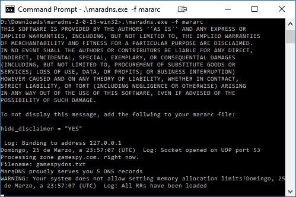
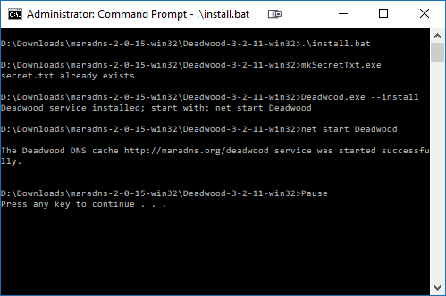

# maradns/deadwood Instructions

The following instructions assume the following:

* you are running maradns & deadwood on the same Windows PC as Gonespy
* your PS3 is on the same network as your PC
* **your PC's LAN IP address is 192.168.2.37 - replace this IP in all of these instructions with your PC's LAN IP address if it differs.** I recommended using a static IP address for your PC so it doesn't change every time you turn your computer on.

maradns is required to make your PS3 think that Gonespy is Gamespy by forwarding all DNS requests for `gamespy.com` and `gamespy.net` to Gonespy.

deadwood is required to forward all other DNS requests from your PS3 to Google's DNS servers so that all other online functionality of your PS3 works correctly.

## Download & configuration

Download `maradns-2-0-15-win32.zip` from [here](http://maradns.samiam.org/download.html)

Extract the zip file somewhere on your computer.

Download the files [`mararc.txt`](https://raw.githubusercontent.com/gonespy/bstormps3/master/guide/mararc.txt) and [`gamespydns.txt`](https://raw.githubusercontent.com/gonespy/bstormps3/master/guide/gamespydns.txt) to your `maradns-2-0-15-win32` folder. Open them up and change the IP address `192.168.2.37` to that of your PC.

Open the `Deadwood-3-2-11-win32` folder and download the file [`dwood3rc.txt`](https://raw.githubusercontent.com/gonespy/bstormps3/master/guide/dwood3rc.txt) there (replacing the existing one), open it, and replace the IP address `192.168.2.37` with that of your PC

## Running maradns/deadwood

### Quick Command Prompt tutorial

If you are not familar with opening a command prompt in Windows 10, you can do this by clicking on the Windows logo (Start menu) in the bottom-left corner of your screen, typing "cmd", then right-clicking on "Command Prompt" that appears and selecting "Run as administrator" (administrator mode is required for starting/stopping deadwood). Then change directory to where you extracted the maradns zip file to. For example, if you extracted the zip file to `D:\maradns-2-0-15-win32` then you would type:

```
cd d:
cd maradns-2-0.15-win32
```

### Starting/stopping maradns

To start maradns, open a command prompt in the maradns folder and type the following:

```
.\mkSecretTxt.exe
.\maradns.exe -f mararc.txt
```

The command prompt should look like this if maradns is running correctly:



Leave this command prompt open - closing it (or pressing Ctrl-C) will stop maradns.

### Starting/stopping deadwood

To start deadwood, open an **administrator** command prompt in the Deadwood-3-2-11-win32 folder and type:

```
.\install.bat
```

This will start deadwood as a Windows service in the background.

The command prompt should look like this if deadwood is running correctly:



You can close this command prompt if you want. When you want to stop deadwood, open an administrator command prompt in the Deadwood-3-2-11-win32 folder and type:

```
.\uninstall.bat
```

## Change your PS3's Network Settings

With maradns & deadwood running, change your PS3's primary DNS server to whatever your PC's IP address is.

### PS3 DNS Instructions

With your PS3 up and running, open Settings > Network Settings from the main screen.

Select Internet Connection Settings.

A message will appear: "Adjust settings for connection to the Internet." Select OK.

Select a setting method: Custom.

Select a connection method:

* If you are using a wired connection, select Wired Connection. Make sure your Ethernet cable is plugged in.
* If you are using a wireless connection, select Wireless. You will be asked to enter your wireless credentials if they have not already been configured.

Select the operation mode of the network device: Manual Settings.

Speed and Duplex: select Auto-Detect.

IP Address Setting: select Automatic.

Set the DHCP host name: select Do Not Set.

DNS Setting: select Manual.

Press the “O” button on the controller to change the Primary DNS settings. Enter the IP address of your PC. Set the Secondary DNS numbers as 0.0.0.0.

MTU Settings: select Automatic.

Proxy Server: select Do Not Use.

UPnP: select Enable.

Finally, press the O button to save the settings.
