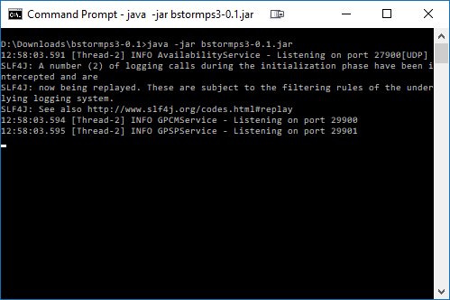

# Gonespy - bstormps3

Alternative Gamespy services for Bulletstorm on PS3.

Thanks to https://github.com/nitrocaster/GameSpy for the Gamespy SDK. Without the SDK code, this project would have been significantly more difficult.

# History
In 2014 the Gamespy servers were shut down. Amongst the games that used Gamespy is Bulletstorm on the PlayStation 3 (PS3) console. The server shutdown rendered the "Anarchy" co-operative game mode unplayable. It also meant that the PlayStation (PS) trophies that involved this game mode were no longer obtainable.

# Overview
This project is a collection of replacement Gamespy mini-services (hereafter referred to as the *"server"*, or by the nickname *"Gonespy"*) that allows you to play the Anarchy game mode again with limited functionality. You can create private matches and play on your own without any problems. Your level/XP is stored within PS3 saved game data, so you can level up as before, unlocking weapon and character skins along the way.

For PlayStation trophy hunters - this means that every single trophy in the game (including DLC, which is still available for purchase on the US PlayStation store) is potentially earnable again.

As a bonus, it should be possible to have Gonespy unlock the exclusive Leash from playing the demo :)

The server has no backend at the moment, meaning some features of the Anarchy game mode do not work as expected - leaderboards, game statistics, high scores etc. It simply implements the bare minimum in order for the client to not have any reason to think that any of the required Gamespy services are unavailable.

Video proof of playing Anarchy: https://www.youtube.com/watch?v=SFGrvtr33kQ

Video proof of unlocking a trophy: https://www.youtube.com/watch?v=0S3hhf6QtNM

## In order to use the server, you need:
* [Java 8 or higher](http://www.oracle.com/technetwork/java/javase/downloads/jre8-downloads-2133155.html) installed on the PC that will be running Gonespy
* a DNS server that can resolve the gamespy.com domain to your Gonespy server, while serving all other DNS requests as normal. You can use [maradns with deadwood](http://maradns.samiam.org/) - see the guide [here](MARADNS_DEADWOOD.md). If you have a router or NAS with DNS functionality, you could use that instead.
* to let incoming traffic for Gonespy and the DNS server through any relevant firewalls. If running DNS & Gonespy on the same Windows PC, you will need to allow incoming traffic through Windows Firewall for the following ports (see [here](http://www.tomshardware.com/faq/id-3114787/open-firewall-ports-windows.html) for instructions):
  * Gonespy:
    * TCP: 80, 443, 29900, 29901
    * UDP: 27900
  * DNS:
    * TCP: 53
    * UDP: 53
* to change your PS3 network settings to use your DNS server - see the guide [here](MARADNS_DEADWOOD.md#change-your-ps3s-network-settings)

## Usage instructions
* Download the latest Bulletstorm Gonespy release from [here](release/bstormps3-0.1.zip)
* Extract the zip file to somewhere on your PC
* Open a [command prompt](MARADNS_DEADWOOD.md#user-content-quick-command-prompt-tutorial) to the location you extracted to
* run the command: ```java -jar bstormps3-0.1.jar```

The command prompt should look like this if Gonespy is running correctly:



Gonespy will remain running until you close the command prompt (or press Ctrl-C in the command prompt to stop it)

## What works (tested & confirmed):
* **Anarchy (private matches)**
* **Multiple PS3s running the game can connect to the same Gonespy server**
* **Inviting other people to join your private matches**
  * **You should not need to be connected to the same Gonespy server to send/accept invites - each person can run their own**
* **XP/leveling**
* **ALL Anarchy mode trophies (including Team Player - [proof](proof/bulletstorm_teamplayer.jpg))**
* **DLC maps**

## What doesn't work:
* Quick Match (matchmaking)
* Leaderboards
* Statistics (some are tracked in the game, others were tracked by Gamespy so they don't show)
* Offline Anarchy (connected to internet, but disconnected from PSN) - this didn't work before, but it was worth a shot!
* Your PSN ID is not shown correctly in-game, it just says "BulletstormPlayer" instead (This doesn't break anything, it just looks weird)

# Troubleshooting Q&A

## When running Gonespy I get errors saying "Address already in use" or similar

The ports needed by Gonespy are probably in use by another program (or maybe you tried to run Gonespy twice?)

Skype uses port 80 so try completely shutting that program down if it is running.

Also note Windows itself will use ports 80 & 443 if IIS features are enabled. To disable these features, go to Programs and Features. Click on Turn Windows features on or off. Uncheck Internet Information Services and also Internet Information Services Hostable Web Core if it is checked. Click OK to remove those applications.

# General Q&A

## Do you think it would be possible to fully restore Anarchy with all functionality by running the server in a public environment?
I'm not sure if that would be a good idea. Gonespy is not secure, and the game sends some encrypted data from the PSN that might allow people to brute-force crack the cryto (Gamespy SDK is quite old and the crypto is weak by modern standards). I'm not 100% sure what is in that data - probably your PSN handle at the very least. Probably not your password, credit card number, SSN :P

(According to the SDK, Sony had to give Gamespy cipher files in order for the servers to decrypt the data mentioned above. Gonespy obviously does not have those ciphers, which, coincidentally, is why your PSN handle is not displayed in the main Anarchy screen)

Aside from the security risk above, I am no network programming expert - I doubt I would be able to restore all other functionality without help. I don't think the interest in this game is strong enough to warrant the effort.

I advise running your own Gonespy server within your own network.

## Does Gonespy support any games other than Bulletstorm?

Not intentionally. Gonespy contains dumb implementations of the specific Gamespy services required for Bulletstorm's Anarchy mode to work in private matches. The services themselves are not Bulletstorm-specific. You could try it with other PS3/Vita games and see what happens! Any game that requires matchmaking will definitely not work. Games with private game modes that let you invite friends might work.

Gonespy is PSN-specific so it will probably only work for PS3/Vita games, and not for PC/Xbox/Wii/DS etc. games.

See [here](http://aluigi.altervista.org/papers/gslist.cfg) for a list of games that use Gamespy.

The following games have been reported by users as working to some degree:

* 50 Cent: Blood on the Sand
* Unreal Tournament 3

In general, games that use Unreal Engine seem to have a good chance of working with Gonespy.

## Could this get you banned from PSN?
Unlikely. The Gamespy servers do not communicate directly with the PSN in any way. Only the game client communicates with the PSN.

## Do you have to mod your PS3 to use Gonespy?
Nope. As stated above, all you need to do is change your PS3 network settings to use a custom DNS server to trick the game into thinking that Gonespy is the real deal!

## Does Gonespy work on operating systems other than Windows?

While untested and no guide exists for any operating system other than Windows 7 or later, it should. As long as you can install Java 8 on it and run your own DNS server, it should be possible.

A user has reported success using Gonespy with `dnsmasq` on Linux.

## Why can't Gonespy work with games that don't use Unreal Engine? eg. FEAR 2

Games that use GameSpy perform a remote authentication check, sending a digital certificate to the GameSpy server.

The game expects the server to respond with a similar certificate, with an additional signature field that is created by encrypting the certificate data with an unknown private key.

The game attempts to decrypt the signature field with the matching public key (which is known). I don't know what the 
private key is, so it is impossible to generate a signature field that the game expects.

Games that use Unreal Engine seem to have a bug/feature where the game doesn't really care if the certificate signature is wrong. 
This is why Gonespy works with games like Bulletstorm and Unreal Tournament III.

## Can't you just "crack" the private key?

There are two well-known approaches to cracking RSA keys - brute force, and integer factorisation.

### Brute force

This is the "dumb" approach. The key pair is 1024 bit RSA which would take a very long time to brute force crack. You would need the computing resources of a
first-world government(s) to do it in a reasonable amount of time, and even then it would take years. See [here](https://blog.codinghorror.com/brute-force-key-attacks-are-for-dummies/) if you want to know more.

### Integer factorisation

This seems to be the most popular approach academics use to crack RSA keys. There has been some activity in late 2019/eary 2020 cracking keys up to 829-bit using open source software [CADO-NFS](http://cado-nfs.gforge.inria.fr/) which is promising to see. This software is under active development, and getting more efficient in its approach. The software can be run in cloud computing environments allowing you to leverage the power of many PCs to contribute to the cracking of a key. Research teams typically use supercomputing resources like [Grid5000](https://www.grid5000.fr/) to accomplish this.

If a research team is able to crack the [RSA challenge 1024-bit key](https://en.wikipedia.org/wiki/RSA_Factoring_Challenge) (which will probably happen in the next 10 years) that *might* mean the Gamespy key could feasibly be cracked also, but it would require a community effort with hundreds/thousands of people donating their computing resources (think [Folding@Home](https://en.wikipedia.org/wiki/Folding@home). However, it is a race against time - will the PS3 still be PSN-enabled by the time the key can be cracked?

## Could anyone know what the private key is?

The private key would have been included in the GameSpy source code. Ex-GameSpy employees might know it. GameSpy was bought by IGN and then Glu Mobile, so it's also possible one or both of those companies still have knowledge of the private key.

It would be great if Glu Mobile were kind enough to release the private key so anyone could emulate the GameSpy services, given it is extremely unlikely GameSpy will ever be revived. Even if it was, they would probably upgrade their key sizes to at least 2048 bit rather than continuing to use the same old 1024 bit key.

## Can't you just use a different key pair?

To use a different key pair, you would have to hack the game code to use a different public key. To do this you would need custom firmware, and even then I'm not sure how easy this is.

Using custom firmware is against Sony's TOS, and also not allowed on trophy leaderboard sites for unlocking unobtainable trophies, so this is not a good solution.

Hacking the game code on PC to use a different public key is comparatively quite easy, so this method works well for PC games. 
However, hacking the game code is currently deemed a DMCA violation in the United States - some projects that have gone this route have shut down due to the thread of legal action.

## Can further work be done to get Unreal Engine games working with matchmaking etc?

Yes. Anyone with networking programming experience and knows their way around Wireshark can use Gonespy as a starting point, and test games - checking Gonespy output to see what the game client is sending, and using the GameSpy SDK to work out how the server should respond.

For example, MK vs DC (PS3) requires GameSpy's chat service to be running, as text chat lobbies are part of the online 
experience. The chat service has not been implemented yet.

## Can Gonespy support platforms other than PlayStation?

Potentially, but some work would be required to handle the initial login request, as this differs for other platforms.

# Trophy Q&A
## Could this get your PSN account flagged on third party trophy tracking sites and leaderboards?
Probably, at least until those sites are aware of Gonespy and accept that using it does not fall within their definitions of "cheating". Anyone who unlocks "unobtainable" trophies via this method may have their account flagged on those sites. The Overview section above contains video links to prove that it works so that hopefully these sites will not take action against your account if you choose to use Gonespy.

### Site-specific stances

* **psnprofiles.com** - The site owner has publically stated he is ok with using Gonespy *as long as it cannot shortcut/autopop trophies* - [proof](https://forum.psnprofiles.com/topic/58898-earning-trophies-on-3rd-party-independently-revived-psn-game-servers/?page=8#comment-1533517)
* **psntrophyleaders.com** - The founder and a mod from psntrophyleaders.com have stated they do not consider using Gonespy to unlock Bulletstorm trophies cheating
* **truetrophies.com** - The site owner has stated via PMs with a mod that he is ok with using Gonespy *as long as it cannot shortcut/autopop trophies*

## Is this cheating?
No. You still have to put in the same amount of effort to get the trophies as before. There is nothing that the Gonespy server currently does or will ever be able to do that will fast-track or immediately unlock any trophies.

## But it is cheating! You are using third party software to unlock unobtainable trophies!

Why should these trophies be classed as forever unobtainable just because the developer/publisher/Gamespy decided to shut down the official servers? Why should gamers that own this game be blocked from content and trophies through no fault of their own? If there is an alternative way unlock the trophies that still involves meeting the same requirements and time/effort investment, then how is this cheating?

If the game's developers knew of Gonespy and were ok with it - would it be "legit" then?

If the gamespy.com domain expired and I bought it myself and set up a public Gonespy server there - removing the requirement to set your PS3's DNS server to your own one - would it be "legit" then?

# Disclaimer
You use Gonespy at your own risk. I cannot and will not be responsible for any hardware or software damage to a computer, PS3 console, networking equipment or other device, nor banning or limitations imposed on your PSN account, whilst using the Gonespy software.

# Trademarks/Copyright

Gamespy SDK copyright (c) 2011, IGN Entertainment, Inc. ("IGN"). All rights reserved.

Bulletstorm game software copyright (c) Electronic Arts / People Can Fly. All rights reserved.

PlayStation copyright (c) Sony Corporation. All rights reserved.
